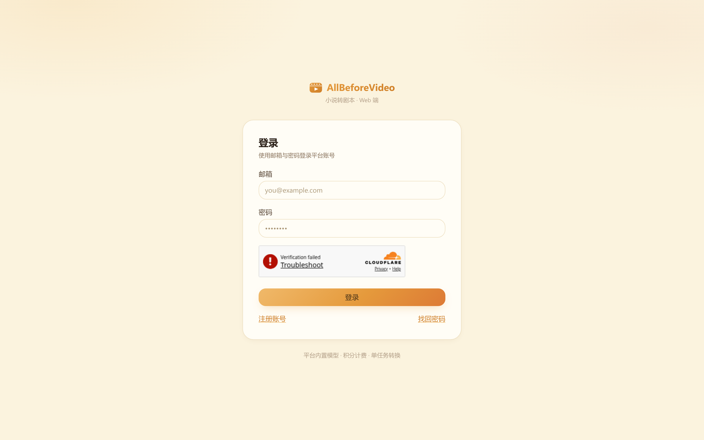
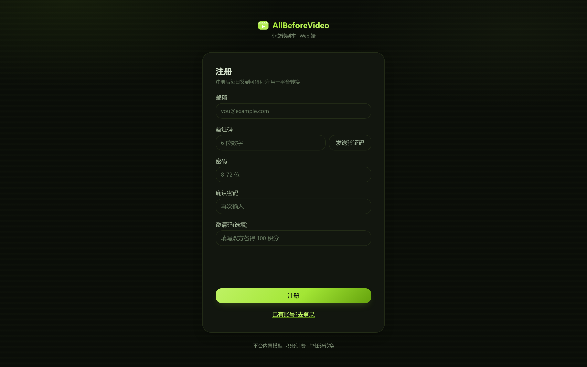
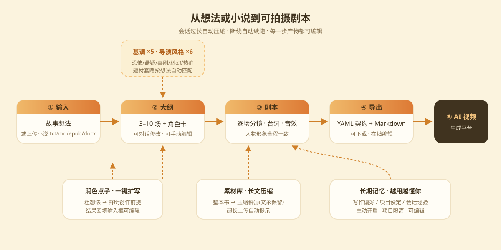

# ALLBEFOREVEDIO 小说转剧本工具

> AI 剧本平台 — 对话式创作，输出影视级结构化剧本

- **在线使用**：<https://allbeforevedio.asia>
- **下载**：请到 [Releases](https://github.com/DingAnZhong/allbeforevideo/releases) 下载

## 界面预览

| 浅色 · 淡黄奶油 | 夜间 · 黑绿数码 |
| --- | --- |
|  |  |

## 产品简介

AllBeforeVideo 是一个 AI 驱动的剧本生产平台。登录后的首页是**项目工作台**，从一个项目进入创作、原文转分镜或剧本诊断，任务、版本与成果都留在对应项目中。

### 核心亮点

- **专精剧本生产** — 先产出高质量剧本，再对接各大 AI 视频平台
- **项目工作台** — 固定项目与最近项目分区展示，项目多时可进入项目库搜索、打开、导入或导出
- **角色与道具采集库** — 每个项目沉淀人物/道具档案并可生成参考图；场景速写自动携带外观设定，角色形象全程一致
- **结构化剧本编辑** — 默认按场、按镜头修改动作、对白、旁白、音效和镜头参数；同时保留分镜参数、排版预览与「源码（高级）」四种视图
- **基调与导演风格** — 基调五选 + 导演风格六选一键切换，题材套路自动匹配；**润色点子**一键把粗想法扩写成鲜明创作前提
- **可控记忆** — 用户主动开启后才整理；仅明确的长期写作偏好可跨项目，角色、设定和经验严格留在当前项目
- **本地优先备份** — 个人中心可导入/导出全部项目、素材、记忆和自定义 skill；有效普通订阅可额外明确开启加密云备份（默认关闭、仅保留最新快照）
- **灵活导出** — 剧本 Markdown、分镜 CSV、含图 zip、素材库 zip、系列整剧 ZIP；项目整体备份为单个 zip（含图片），可导入还原
- **长文压缩** — 超长小说一键生成压缩稿，省积分、保剧情（原文永保留）；会话过长自动压缩
- **双主题界面** — 淡黄奶油浅色 / 黑绿数码夜间，跟随切换
- **悬浮球助手** — 全站右下角桌宠（4 个手绘形象可换、可拖拽），常见问题 / 用户手册 / 客服微信一键直达
- **订阅套餐** — 周/月/季与急用卡（可叠加、同档顺延），每日自动发放积分，到期前邮件提醒
- **自定义 skill（订阅专属）** — 导演风格/氛围基调两类：描述 + AI 联网蒸馏出草稿，可编辑入库随请求注入

## 用户文档

| 文档 | 说明 |
| --- | --- |
| [用户手册（中文）](manual.zh.md) | 快速上手、项目与创作、角色与道具采集库、素材库、记忆、积分与支付、数据与备份 |
| [User Manual (English)](manual.en.md) | English user manual |
| [常见问题（中文）](faq.zh.md) | 登录账号 / 支付与积分 / 创作与素材等常见问题 |
| [FAQ (English)](faq.en.md) | English FAQ |

## 联系管理员

遇到问题或无法自助解决时，微信扫码添加管理员：

| 管理员一 | 管理员二 |
| --- | --- |
|  |  |

微信号：`Jack-_Yang`
